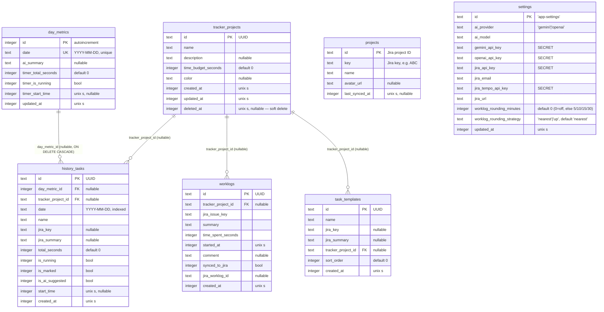

# Task Tracker — Database Schema Export

Generated: 2026-07-19 (updated after migrations `0002`+`0003`) from the **live Turso database** (matches `src/db/schema.ts`).
Regenerate with: `npm run db:schema:export`

- Engine: SQLite (Turso / libSQL), managed by Drizzle ORM + drizzle-kit migrations (`drizzle/`)
- Source of truth for the schema: `src/db/schema.ts`

## Data conventions (important for any client, incl. mobile)

| Concept | Storage | Example |
|---|---|---|
| Timestamps (`*_at`, `start_time`) | `integer` — **Unix epoch seconds** (not ms) | `1778751083` |
| Calendar dates (`date`) | `text` — `YYYY-MM-DD` (local day key) | `2026-07-17` |
| Booleans (`is_*`, `synced_to_jira`, `timer_is_running`) | `integer` — `0` / `1` | `1` |
| Primary keys | `text` — UUID v4, generated by the app | `04a241d3-10d6-…` |
| Exceptions to UUID PKs | `day_metrics.id` = autoincrement integer; `projects.id` = Jira project ID; `settings.id` = fixed literal `'app-settings'` | |
| Durations | `integer` — seconds | `3600` |

> ⚠️ Column defaults like `created_at DEFAULT '"2026-07-06T20:51:08.733Z"'` are a Drizzle artifact of `.default(new Date())` — the JSON string of the *migration generation time* baked into DDL. The app always sets these values explicitly; **clients must never rely on DB defaults for timestamps.**

## ER diagram



## Tables

### `tracker_projects` — internal projects with time budgets
The app's own project entity (not Jira). Used to group tasks/worklogs and track a time budget. Deletion is **soft**: `deleted_at` is set instead of removing the row, so historical `history_tasks`/`worklogs` keep their project name/color. Clients should filter `WHERE deleted_at IS NULL` for active-project lists.

### `day_metrics` — one row per calendar day
Day-level timer state and AI-generated day summary. `date` is unique — natural key for a day. `timer_*` columns hold the global day timer (running flag + start time + accumulated seconds).

### `history_tasks` — individual tracked tasks within a day
The core time-tracking rows. Linked to a day via `day_metric_id` (cascade delete with the day) and optionally to a `tracker_projects` row. `total_seconds` is the accumulated tracked time; when `is_running = 1`, live elapsed time = `total_seconds + (now - start_time)`. `jira_key`/`jira_summary` are denormalized Jira issue info.

### `worklogs` — worklog entries prepared for / synced to Jira Tempo
`synced_to_jira` + `jira_worklog_id` track sync state. `started_at` is the worklog start (Jira semantics), `time_spent_seconds` the logged duration.

### `projects` — cached Jira projects
Read-only cache of Jira projects (currently empty). Distinct from `tracker_projects`.

### `settings` — single-row app settings
PK is the literal `'app-settings'`. **Contains API secrets (Gemini, OpenAI, Jira, Tempo).** Must never be exposed to or synced into a mobile client.

### `task_templates` — reusable templates for daily tasks
Stores template tasks with their default project and Jira link. Can be quickly spawned on the dashboard.

## Live DDL (Turso, 2026-07-19)

```sql
CREATE TABLE "tracker_projects" (
	`id` text PRIMARY KEY NOT NULL,
	`name` text NOT NULL,
	`description` text,
	`time_budget_seconds` integer DEFAULT 0 NOT NULL,
	`color` text,
	`created_at` integer NOT NULL,   -- unix seconds (DDL default is a Drizzle artifact, see above)
	`updated_at` integer NOT NULL,
	`deleted_at` integer   -- nullable; set on soft delete, see notes above
);

CREATE TABLE "day_metrics" (
	`id` integer PRIMARY KEY AUTOINCREMENT NOT NULL,
	`date` text NOT NULL,
	`ai_summary` text,
	`timer_total_seconds` integer DEFAULT 0 NOT NULL,
	`timer_is_running` integer DEFAULT false NOT NULL,
	`timer_start_time` integer,
	`updated_at` integer NOT NULL
);
CREATE UNIQUE INDEX `day_metrics_date_unique` ON `day_metrics` (`date`);

CREATE TABLE "history_tasks" (
	`id` text PRIMARY KEY NOT NULL,
	`day_metric_id` integer,
	`tracker_project_id` text,
	`date` text NOT NULL,
	`name` text NOT NULL,
	`jira_key` text,
	`jira_summary` text,
	`total_seconds` integer DEFAULT 0 NOT NULL,
	`is_running` integer DEFAULT false NOT NULL,
	`is_marked` integer DEFAULT false NOT NULL,
	`is_ai_suggested` integer DEFAULT false NOT NULL,
	`start_time` integer,
	`created_at` integer NOT NULL,
	FOREIGN KEY (`day_metric_id`) REFERENCES `day_metrics`(`id`) ON UPDATE no action ON DELETE cascade,
	FOREIGN KEY (`tracker_project_id`) REFERENCES `tracker_projects`(`id`) ON UPDATE no action ON DELETE no action
);
CREATE INDEX `idx_history_tasks_date` ON `history_tasks` (`date`);

CREATE TABLE "worklogs" (
	`id` text PRIMARY KEY NOT NULL,
	`tracker_project_id` text,
	`jira_issue_key` text NOT NULL,
	`summary` text NOT NULL,
	`time_spent_seconds` integer NOT NULL,
	`started_at` integer NOT NULL,
	`comment` text,
	`synced_to_jira` integer DEFAULT false NOT NULL,
	`jira_worklog_id` text,
	`created_at` integer NOT NULL,
	FOREIGN KEY (`tracker_project_id`) REFERENCES `tracker_projects`(`id`) ON UPDATE no action ON DELETE no action
);

CREATE TABLE `projects` (
	`id` text PRIMARY KEY NOT NULL,
	`key` text NOT NULL,
	`name` text NOT NULL,
	`avatar_url` text,
	`last_synced_at` integer
);

CREATE TABLE `settings` (
	`id` text PRIMARY KEY NOT NULL,
	`ai_provider` text DEFAULT 'gemini' NOT NULL,
	`ai_model` text DEFAULT 'gemini-2.5-flash' NOT NULL,
	`gemini_api_key` text DEFAULT '' NOT NULL,
	`openai_api_key` text DEFAULT '' NOT NULL,
	`jira_api_key` text DEFAULT '' NOT NULL,
	`jira_email` text DEFAULT '' NOT NULL,
	`jira_tempo_api_key` text DEFAULT '' NOT NULL,
	`jira_url` text DEFAULT '' NOT NULL,
	`worklog_rounding_minutes` integer DEFAULT 0 NOT NULL,
	`worklog_rounding_strategy` text DEFAULT 'nearest' NOT NULL,
	`updated_at` integer NOT NULL
);

CREATE TABLE `task_templates` (
	`id` text PRIMARY KEY NOT NULL,
	`name` text NOT NULL,
	`jira_key` text,
	`jira_summary` text,
	`tracker_project_id` text,
	`sort_order` integer DEFAULT 0 NOT NULL,
	`created_at` integer NOT NULL,
	FOREIGN KEY (`tracker_project_id`) REFERENCES `tracker_projects`(`id`) ON UPDATE no action ON DELETE no action
);
```

> `worklog_rounding_minutes`/`worklog_rounding_strategy` (spec 003/F2) and `tracker_projects.deleted_at` (spec 003/F9) are deployed and live on Turso (migrations `0002_deep_jane_foster` + `0003_far_prism`, applied 2026-07-19). `task_templates` (spec 003/F5) is deployed and live on local SQLite/Turso (migration `0004_left_whizzer`, applied 2026-07-19).

## Notes for the mobile app

- **Relevant tables to start with:** `tracker_projects`, `day_metrics`, `history_tasks`, `worklogs`, `task_templates`. Skip `projects` (empty Jira cache) and **exclude `settings` entirely** — it holds API secrets.
- **Shared data:** the DB lives in Turso, so the mobile app can share it either
  1. via the libSQL mobile SDKs (Swift / Kotlin / React Native / Flutter) with **embedded replicas + offline sync** talking straight to the same Turso DB, or
  2. via an API layer in this app (TanStack Start server routes) — safer if secrets/auth logic should stay server-side.
- **Concurrency hazard:** `history_tasks.total_seconds` and the running-timer columns are read-modify-write from the web app. A second writer (mobile) must not clobber tracked time — prefer additive updates or single-writer design for timer state.
- **Timer semantics:** a running task = `is_running = 1` + `start_time` set; display time = `total_seconds + (now − start_time)`. Same pattern for the day timer on `day_metrics`.
