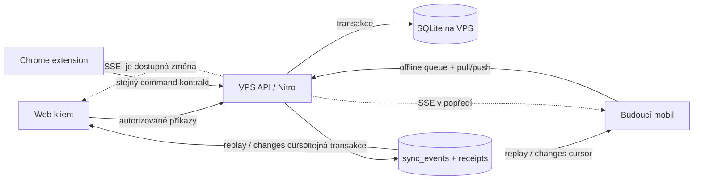

# Audit připravenosti pro VPS, SSE a mobilní synchronizaci

Datum auditu: 2026-08-31  
Repozitář: `/home/tomas/my-projects/task-tracker`  
Větev: `fear/tempo`

## Výsledek v jedné větě

Aplikace je funkční jako lokální single-user nástroj, ale před zveřejněním na VPS potřebuje autentizaci, jednu autoritativní persistence cestu a serverově atomické mutace; teprve nad nimi má smysl přidat durable Server-Sent Events (SSE) a mobilní synchronizaci.

## Verdikt

| Oblast | Stav | Priorita |
|---|---|---:|
| Lokální používání | použitelné; 70/70 testů a produkční build procházejí | — |
| Veřejný VPS | **nenasazovat veřejně v aktuálním stavu** | P0 |
| Více současných klientů | hrozí ztracené update a dva paralelní timery | P0 |
| Mobilní/offline sync | chybí identity zařízení, cursor, tombstones, idempotence a konfliktní politika | P1 |
| Datové SSE | neexistují; stávající agent stream je NDJSON a řeší jiný problém | P1 |
| Performance | pro osobní lokální dataset přijatelná, několik známých škálovacích míst | P1/P2 |
| Type safety | build projde, samostatný TypeScript check ne: 95 chyb ve 25 souborech | P1 |

Největší blocker není transport. Je jím současný model mutací: klient počítá nový stav ze své cache a server bez verze přepíše celý řádek. SSE by takový konflikt pouze rychleji rozeslalo dalším klientům.

## Cílový tok

SSE je pouze budicí kanál. Zdroj pravdy je databázová transakce a synchronizační API; po reconnectu se klient opraví přes durable cursor a replay.

## Doporučené pořadí

1. P0: ochránit všechny server functions a API routes, zavést jeden účet/session a rotovat vystavené tokeny.
2. P0: přesunout timer a extension z JSON souborů do jedné DB/domain služby; mutace timeru dělat atomickými příkazy.
3. P1: přidat `user_id`, `version`, `updated_at`, `deleted_at`, `sync_events` a `mutation_receipts`.
4. P1: dodat snapshot/changes/commands kontrakt a konfliktní politiku.
5. P1: dodat authenticated SSE s `Last-Event-ID`, replayem, heartbeatem a proxy konfigurací.
6. P1: napojit React Query, extension a následně mobil; otestovat reconnect, retry, konflikty a obnovu ze zálohy.

## Tematické výstupy

- [Současná architektura](architecture/current-state.md)
- [Security audit](security/findings.md)
- [Performance audit](performance/findings.md)
- [Reliability a provoz na VPS](reliability-operations/findings.md)
- [Testy a udržovatelnost](quality/testing-maintainability.md)
- [Cílový SSE a mobile-sync návrh](sync/sse-mobile-plan.md)

Strojově validovatelné realizační plány jsou navíc v `.codex/plans/`.

## Ověření provedená během auditu

- `npm test`: **14 test files, 70 tests, vše prošlo**.
- `npm run build`: **exit 0**; klientský entry chunk 514,66 kB a build warning k type importu `JiraCredentials`.
- `npm exec tsc -- --noEmit`: **exit 2, 95 chyb ve 25 souborech**.
- Fallow 2.86: skóre **A / 88,1**, současně 53 funkcí nad nastavenými prahy, z toho 9 kritických; 1 unused export, žádné circular dependencies.
- Fallow security vrátil 11 path-traversal kandidátů. Ruční verifikace ukázala, že uvedené cesty skládají serverové `process.cwd()` a pevné názvy; nejsou proto v této podobě potvrzenou zranitelností.
- `npm audit --omit=dev --json`: **8 zranitelností (6 high, 2 low)**; všechny mají dostupnou opravu, ale jejich runtime dosažitelnost je potřeba po aktualizaci jednotlivě ověřit.
- Produkční provoz, reverse proxy, záloha/restore a reálný mobilní klient nebyly dostupné, proto nebyly runtime ověřeny.

## Pracovní předpoklady plánu

- první nasazení je single-user, bez veřejné registrace;
- jedna Nitro instance na jednom VPS;
- referenční persistence je SQLite na persistentním volume, zálohovaná mimo VPS;
- Turso zůstává možný adapter, ale mobil se nikdy nepřipojuje přímo DB tokenem;
- extension zůstává podporovaná a postupně přejde na stejný API kontrakt;
- mobil potřebuje eventual offline zápisy, ne pouze read-only obrazovku.

Pokud se některý předpoklad změní, největší dopad má volba multi-user, více serverových instancí a požadavek na dlouhodobý offline režim.
