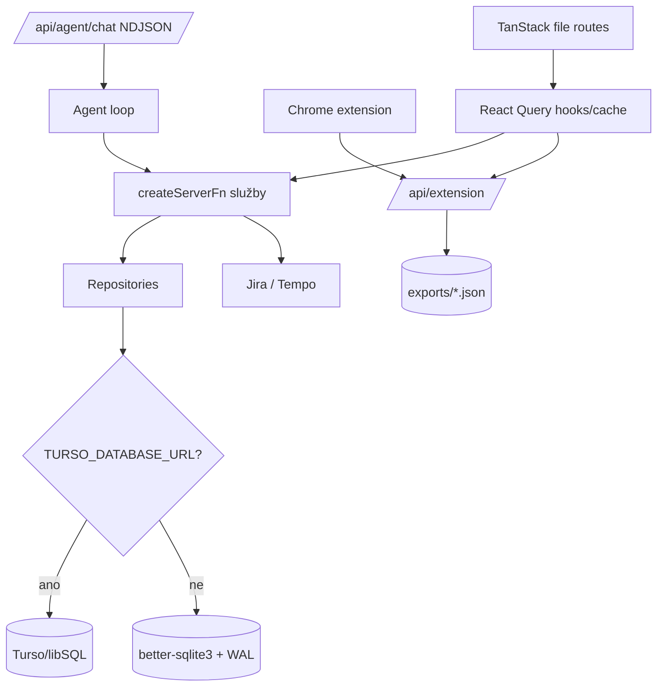

# Současná architektura a datový tok

## Scope a jistota

Audit pokrývá TanStack Start/Nitro runtime, React Query klienta, server functions, repositories, SQLite/Turso adapter, extension, Jira/Tempo a agent stream. Tvrzení níže jsou ověřena ze zdrojového kódu; stav reálného Turso účtu a VPS není z repozitáře ověřitelný.

## Systémová mapa

## Hlavní moduly

| Vrstva | Odpovědnost | Evidence |
|---|---|---|
| Router/runtime | file routes, QueryClient context, root shell | [src/router.tsx:5](../../../src/router.tsx#L5), [src/routes/__root.tsx:20](../../../src/routes/__root.tsx#L20) |
| Klientská data | per-day Query cache, optimistic mutace, výpočet běžícího času | [src/hooks/useTasks.ts:63](../../../src/hooks/useTasks.ts#L63), [src/hooks/useTasks.ts:78](../../../src/hooks/useTasks.ts#L78) |
| Server functions | validace a orchestrace task/project/settings/Jira operací | [src/services/tasksServer.ts:62](../../../src/services/tasksServer.ts#L62), [src/services/projectsServer.ts:6](../../../src/services/projectsServer.ts#L6), [src/services/settingsServer.ts:23](../../../src/services/settingsServer.ts#L23) |
| Persistence | generický repository pattern nad singletonem Drizzle DB | [src/repositories/base.repository.ts:6](../../../src/repositories/base.repository.ts#L6), [src/db/index.ts:24](../../../src/db/index.ts#L24) |
| Extension | separátní timer/clip JSON persistence s shared tokenem | [src/routes/api.extension.ts:33](../../../src/routes/api.extension.ts#L33), [src/services/extensionAuth.ts:5](../../../src/services/extensionAuth.ts#L5) |
| Agent stream | request-scoped NDJSON stream; není to datový sync kanál | [src/routes/api.agent.chat.ts:21](../../../src/routes/api.agent.chat.ts#L21), [src/routes/api.agent.chat.ts:38](../../../src/routes/api.agent.chat.ts#L38) |

## Reprezentativní tok: změna task timeru

1. `useTasks` přečte den do cache `['history', date]` ([src/hooks/useTasks.ts:78](../../../src/hooks/useTasks.ts#L78)).
2. Při start/stop klient vypočte elapsed time ze své cache a sestaví celý nový task snapshot ([src/hooks/useTasks.ts:214](../../../src/hooks/useTasks.ts#L214)).
3. `updateTaskFn` ověří shape přes Zod, načte existující řádek a provede insert nebo bezpodmínečný update ([src/services/tasksServer.ts:116](../../../src/services/tasksServer.ts#L116), [src/services/tasksServer.ts:134](../../../src/services/tasksServer.ts#L134)).
4. Klient optimisticky nebo po success přepíše vlastní Query cache. Žádný druhý klient není upozorněn.

Tento tok je bezpečný pouze za předpokladu jediného zapisujícího klienta. Neobsahuje compare-and-swap, transakční invariant „jen jeden timer“, mutation ID ani durable event.

## Persistence varianty

- `TURSO_DATABASE_URL` zapíná libSQL/Turso; jinak se použije `DATABASE_URL` nebo `.db/task-tracker.sqlite`, lokálně s WAL ([src/db/index.ts:9](../../../src/db/index.ts#L9), [src/db/index.ts:24](../../../src/db/index.ts#L24)).
- Drizzle config používá stejný env přepínač ([drizzle.config.ts:3](../../../drizzle.config.ts#L3)).
- Ruční migrační runner umí jen `better-sqlite3`, vypíná foreign keys a není napojený v `package.json` ([src/db/migrate.ts:18](../../../src/db/migrate.ts#L18), [src/db/migrate.ts:24](../../../src/db/migrate.ts#L24), [package.json:11](../../../package.json#L11)).
- Repo neobsahuje Dockerfile/Compose/systemd/reverse-proxy/CI deploy konfiguraci.

## Co už je dobrý základ

- SQL persistence a repository vrstva už existují.
- Kritické vstupy většiny server functions validuje Zod.
- Secrets se při čtení settings nevracejí do klienta, pouze boolean příznaky ([src/services/settingsServer.ts:7](../../../src/services/settingsServer.ts#L7)).
- Historie se na dashboardu načítá po jednom dni a `history_tasks.date` má index ([src/hooks/useTasks.ts:78](../../../src/hooks/useTasks.ts#L78), [src/db/schema.ts:66](../../../src/db/schema.ts#L66)).
- Projekt má soft delete a některé tabulky mají `updated_at`, což lze rozšířit do jednotného sync modelu.
- Nitro už umí streamovat `ReadableStream`; protokol agent chatu však zůstává oddělený od nového SSE subsystému.

## Varianty a otevřené otázky

- Dokumentace zmiňuje živé Turso, uživatel popisuje lokální provoz a runtime rozhoduje podle `.env`; autoritativní dnešní DB proto z kódu nelze určit.
- Single-user lze provozovat s jedním seeded účtem. Neznamená to vypustit authorization scope: bez `user_id` by pozdější přechod na více účtů zasáhl všechny tabulky a cursory.
- Jeden proces dovolí okamžitý in-memory fanout SSE. Durable `sync_events` je přesto nutný pro restart a reconnect; více procesů by navíc vyžadovalo broker nebo DB polling.

## Historický kontext

- `1654372`: přesun historie/settings z localStorage do SQLite.
- `3def788`: per-day Query cache.
- `cda6b79`: Drizzle migrations, day metrics a Turso runtime.
- `3bf6af3`: agent streaming a server function vydávající extension token.
- `a9fda4b`: task templates end-to-end.

Současný kód vznikal evolučně z lokální aplikace. Dvojí timer persistence a absence identity tomu odpovídají; nejde o hotový distribuovaný systém.
