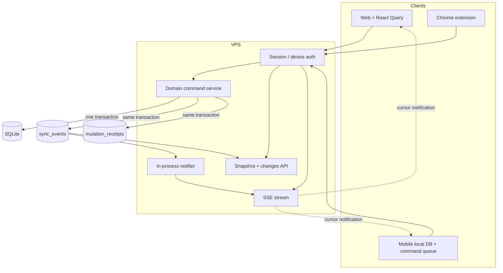

# Plán: durable SSE a budoucí mobilní synchronizace

## Cíl

Nasadit aplikaci na osobní VPS tak, aby web, extension a budoucí mobil četly a měnily stejná data bez ztracených update. Server-Sent Events zajišťují rychlé upozornění; synchronizační správnost zajišťují autorizované command/pull API, transakční event log, cursory, idempotence a konfliktní politika.

Termín „server side eventy“ zde znamená standard **Server-Sent Events (SSE)**, tedy jednosměrný HTTP stream server → klient.

## Přijatá výchozí rozhodnutí

- Single-user účet bez registrace, ale všechny řádky/eventy budou od začátku scopeované `user_id`.
- VPS API je jediný writer a jediná důvěryhodná hranice; mobil ani extension nemají DB/Turso token.
- Referenční první deployment: jedna Nitro instance + SQLite persistent volume. Turso je alternativní adapter po contract testech.
- Offline mobilní zápisy jsou možné přes command queue.
- Konflikty se nepřepisují tiše; server vrací `409` s aktuální verzí.
- Timer používá explicitní `start`, `stop`, `adjust`, ne toggle/full snapshot.
- SSE posílá malé invalidace s cursorem; data klient stáhne přes `changes`.

## Cílové komponenty



## Schema změny

### Syncovatelné entity

Pro `history_tasks`, `day_metrics`, `tracker_projects`, `task_templates` a relevantní lokální `worklogs`:

- `user_id TEXT NOT NULL`;
- `version INTEGER NOT NULL DEFAULT 1`;
- `created_at` a `updated_at` nastavované při insert/update runtime výrazem, ne statickým datem migrace;
- `deleted_at` tombstone místo hard delete;
- indexy začínající `user_id` pro nejčastější read/sync dotazy.

Settings rozdělit:

- synchronizovatelné preference bez tajemství;
- server-only credentials, které se nikdy neobjeví v snapshot/change eventu.

### Nové tabulky

```text
users(id, login, password_hash, timezone, created_at, updated_at)
sessions(id_hash, user_id, expires_at, created_at)
devices(id, user_id, name, token_hash, last_seen_at, revoked_at)

sync_events(
  seq INTEGER PRIMARY KEY AUTOINCREMENT,
  user_id TEXT NOT NULL,
  entity_type TEXT NOT NULL,
  entity_id TEXT NOT NULL,
  operation TEXT NOT NULL,
  entity_version INTEGER NOT NULL,
  day_key TEXT,
  occurred_at INTEGER NOT NULL
)

mutation_receipts(
  user_id TEXT NOT NULL,
  device_id TEXT NOT NULL,
  client_mutation_id TEXT NOT NULL,
  command_type TEXT NOT NULL,
  result_json TEXT NOT NULL,
  created_at INTEGER NOT NULL,
  UNIQUE(user_id, device_id, client_mutation_id)
)
```

Payload entity není nutné duplikovat do `sync_events`; `changes` může podle eventu načíst aktuální sanitizovanou entitu. Tombstone musí nést dost informací pro delete. Pokud měření ukáže příliš mnoho follow-up query, lze přidat sanitizovaný `payload_json`.

## Domain command kontrakt

Každý command obsahuje:

```json
{
  "deviceId": "uuid",
  "clientMutationId": "uuid",
  "type": "task.stop",
  "entityId": "uuid",
  "baseVersion": 7,
  "payload": {}
}
```

Server v jedné transakci:

1. zkontroluje auth a ownership;
2. vrátí uložený receipt při duplicitním mutation ID;
3. ověří `baseVersion`/invarianty;
4. změní entitu a zvýší `version`;
5. vloží `sync_events`;
6. uloží receipt;
7. commitne a až potom probudí SSE subscribers.

### Konfliktní politika

| Entita/akce | Politika |
|---|---|
| rename, Jira link, project assignment | optimistic concurrency; `409` s current entity |
| start timer | server atomicky zastaví jiný active timer stejného usera a zapíše oba eventy |
| stop timer | explicitní příkaz; elapsed počítá server ze serverového času |
| adjust/reset time | explicitní auditovatelný příkaz, nikdy skrytý merge |
| create task/template | klientský UUID + idempotency receipt |
| delete | soft delete/tombstone |
| settings preference | per-field patch + version |
| Tempo worklog | idempotency key + state `pending/syncing/synced/failed/deleted` |

`toggle` není bezpečný command: retry po ztracené odpovědi by provedl opačnou operaci.

## Synchronizační HTTP API v1

### `GET /api/v1/sync/snapshot`

Vrátí sanitizovaný stav a `cursor`. Snapshot a cursor musí tvořit konzistentní bod. Preferovaně vzniknou v read transaction; bezpečná alternativa je zachytit high-water mark před snapshotem a tolerovat následné duplicity podle `(entityId, version)`.

### `GET /api/v1/sync/changes?after=<seq>&limit=500`

Vrátí seřazené změny/tombstones a `nextCursor`. Odpověď musí být user-scoped a stránkovaná. Cursor starší než retence vrátí `410 cursor_expired` s instrukcí pro nový snapshot.

### `POST /api/v1/sync/commands`

Přijme jeden command nebo malý batch. Každý command má samostatný výsledek; duplicate vrátí původní receipt, stale version `409`, validation `422`.

Zod schémata umí sdílet web/extension. Současně udržovat jazykově neutrální OpenAPI/JSON kontrakt pro budoucí mobil.

## SSE protokol

Endpoint: `GET /api/v1/sync/events`

```text
retry: 3000

id: 1842
event: sync.changed
data: {"cursor":1842,"entityType":"history_task","entityId":"...","operation":"updated","version":8,"dayKey":"2026-08-31"}

: heartbeat 2026-08-31T10:00:00.000Z

```

Požadavky:

- session/device auth před otevřením streamu;
- browser používá `Last-Event-ID`, mobil může navíc poslat `after` při fetch-based streamu;
- před živým odběrem replaynout durable eventy za cursorem;
- `Content-Type: text/event-stream; charset=utf-8`;
- `Cache-Control: no-cache, no-transform`;
- `X-Accel-Buffering: no`;
- heartbeat 15–25 s;
- AbortSignal cleanup a limit bufferu slow consumer;
- žádný secret/full settings payload;
- při retenční mezeře event `sync.resync-required` a ukončení streamu.

Jedna VPS instance může po commitu použít in-memory notifier. `sync_events` zůstává zdroj replaye. Při přechodu na více instancí se notifier nahradí DB pollingem nebo brokerem; API kontrakt zůstane stejný.

## Web integrace

- Root připojí právě jeden `useSyncEvents` hook.
- Hook ukládá poslední aplikovaný cursor.
- `sync.changed` mapuje na přesné Query keys; nepoužívat globální `invalidateQueries()` pro každý event.
- Při reconnectu nejprve `changes(after=cursor)`, potom stream.
- `refetchOnReconnect` a foreground refresh zůstávají bezpečnostní síť.
- Optimistic UI smí zůstat, ale server response/version je autoritativní; na `409` UI ukáže konflikt.

## Mobilní klient

- Lokální DB obsahuje entity, cursor, pending command queue a receipts.
- Při foreground: push pending commands → pull changes → otevřít SSE.
- V background se na trvalé SSE nespoléhat; correctness zajišťuje pull. APNs/FCM je případný budoucí wake-up kanál.
- Device token je revokovatelný a scopeovaný; secrets třetích stran mobil nikdy nevidí.
- Day key se počítá v explicitní user timezone (výchozí `Europe/Prague`), ne přes UTC `toISOString()`.
- Čas běžícího timeru se zobrazuje ze serverového `startedAt` a server time offsetu.

## Extension migrace

1. Přidat configurable HTTPS base URL a pairing flow po přihlášení.
2. Extension posílá stejné explicitní timer/task commands jako web/mobil.
3. Po ověření paritních testů odstranit `exports/active-timer.json` a daily clip JSON jako runtime store.
4. Existující clips jednorázově importovat s idempotency IDs a archivovat.
5. Rotovat starý shared token a odstranit veřejný `getExtensionTokenFn`.

## Fáze realizace a akceptace

### 0. Stabilizace baseline

- hermetické test DB, `typecheck` baseline, pin runtime balíků;
- opravit worklog PK/idempotency problém;
- odstranit veřejnou `/test` route a citlivé tracked runtime artefakty po explicitním review.

### 1. Bezpečný VPS základ

- login/session, seeded user, auth guard, rate limits, secret handling;
- produkční start, migrace, backup/restore, health, reverse proxy.

Akceptace: anonymní request nečte ani nemění data; restore drill projde.

### 2. Sync-ready doména

- schema revisions/tombstones/events/receipts;
- serverově atomické task/timer commands;
- všechny web/agent/extension mutace používají stejnou domain službu.

Akceptace: dva souběžné starty nezanechají dva běžící timery; retry nezduplikuje změnu.

### 3. Pull/push sync API

- snapshot, changes, commands, cursor retention;
- contract testy a OpenAPI.

Akceptace: offline create/update/delete se po reconnectu korektně promítne a stale edit skončí `409`.

### 4. Durable SSE

- authenticated stream, replay, heartbeat, backpressure, proxy config;
- targeted React Query invalidation.

Akceptace: změna z klienta A se zobrazí klientu B; restart procesu a reconnect neztratí event.

### 5. Extension a mobile readiness

- extension na command API;
- reference mobile sync klient/contract harness;
- monitoring, retention cleanup, staged rollout.

Akceptace: web + extension + simulovaný offline mobil projdou shodný end-to-end scénář.

## Povinné testovací scénáře

1. Dva klienti editují stejný task ze stejné base version.
2. Dva klienti současně startují různé timery.
3. Stejný POST se po timeoutu odešle dvakrát.
4. Klient se odpojí, proběhnou změny a reconnect použije `Last-Event-ID`.
5. Delete offline se promítne tombstonem.
6. Cursor mimo retenci vyžádá snapshot.
7. User/device A nikdy neuvidí data/eventy B.
8. Nitro restart neztratí replay.
9. Slow SSE consumer nezpůsobí neomezenou paměť.
10. Tempo uspěje a lokální krok selže bez duplicitního retry.
11. Prague midnight a změna DST zachovají očekávaný local day.
12. Backup skutečné schema verze lze obnovit a aplikace naběhne.

## Deferred, nikoli součást první verze

- více aktivních Nitro instancí;
- collaborative text merge/CRDT;
- APNs/FCM push notifikace;
- přímá DB replikace do mobilu;
- veřejná registrace a týmové workspaces.

## Rizika a rollback

- Schema backfill dělat additive, nullable → backfill → constraint; před migrací záloha.
- Dual-write neponechávat dlouhodobě. Přechod každé mutace feature flagem, měřit parity, poté odstranit starou cestu.
- SSE lze vypnout bez ztráty správnosti; klient se vrátí na pull/foreground refresh.
- Pokud Turso adapter nesplní transakční contract testy, první rollout zůstane na local SQLite.
- Event payload a API verzovat `/v1`; breaking změna znamená nový endpoint/event version.

## Otevřená rozhodnutí před implementací

1. Zda definitivně zvolit VPS SQLite, nebo Turso jako produkční source of truth.
2. Zda mobil bude React Native/TypeScript (možné sdílet Zod/types), nebo jiný stack (OpenAPI je povinné tak jako tak).
3. Jak dlouhý offline interval podporovat; určuje retenci events/tombstones.
4. Zda extension zůstane produktovou součástí po vydání mobilu.

Tato rozhodnutí nemění potřebu auth, atomických commandů, idempotence a durable cursoru.
